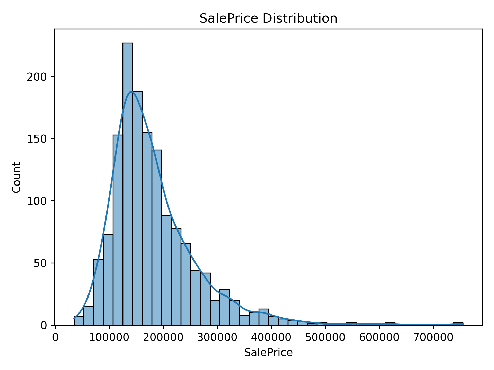
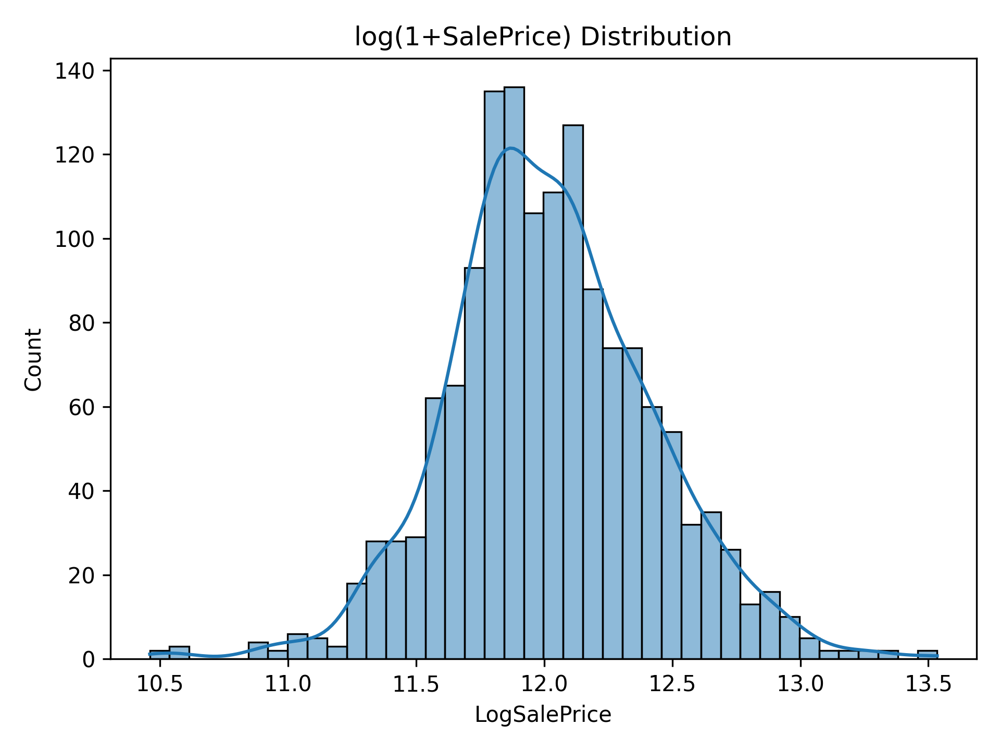
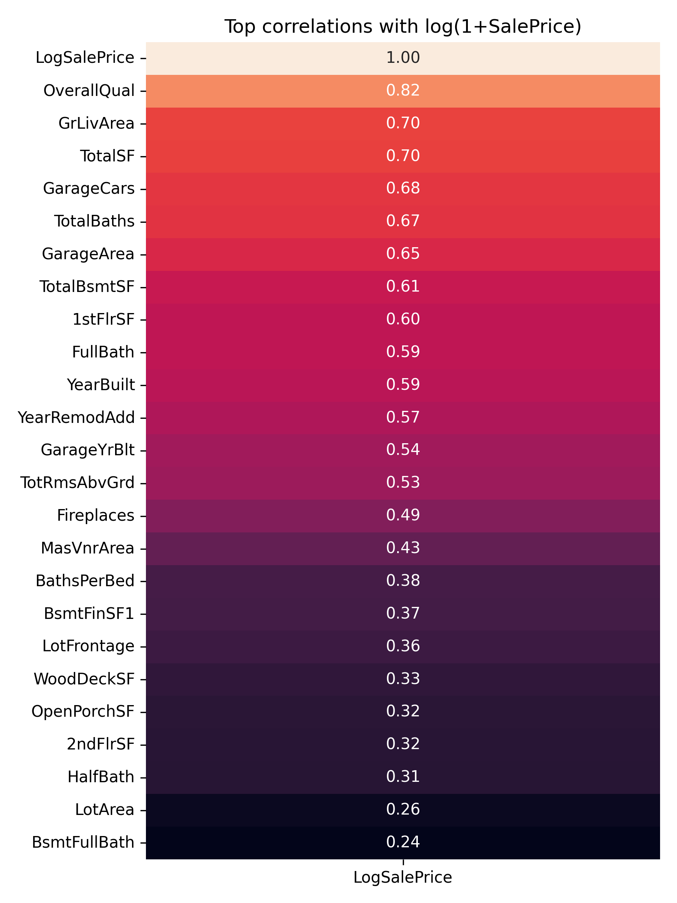
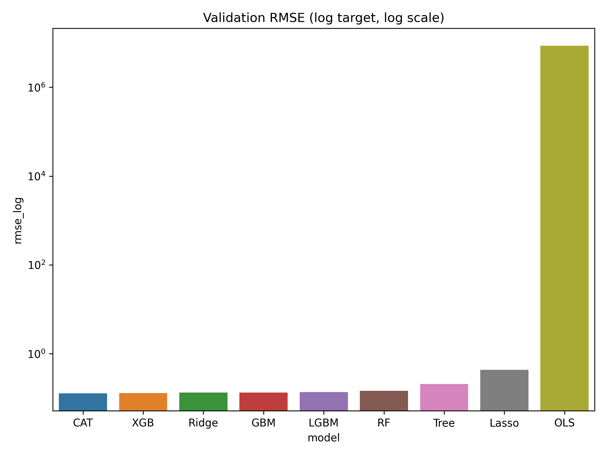
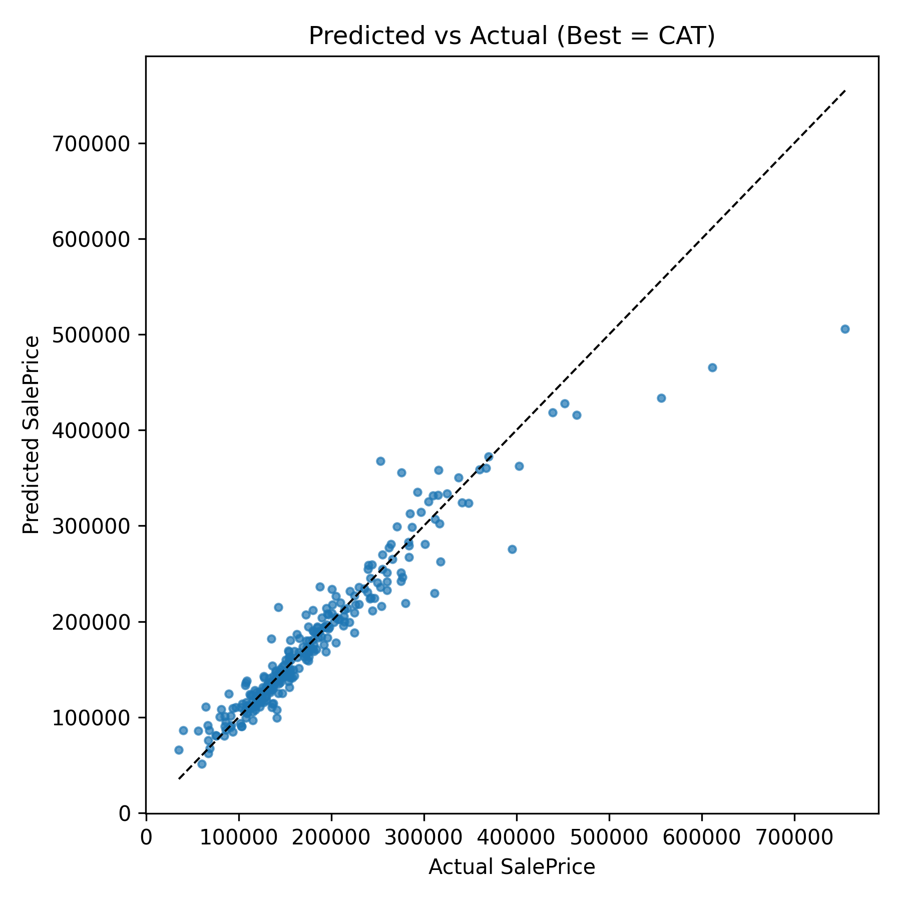
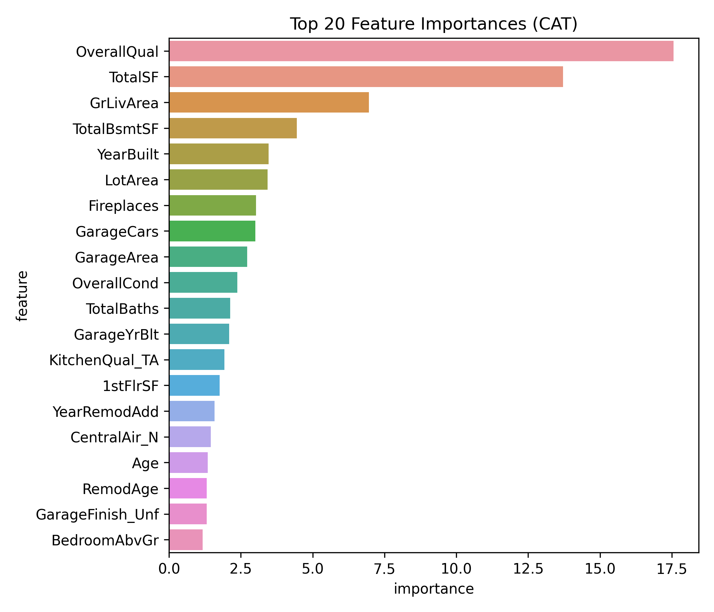
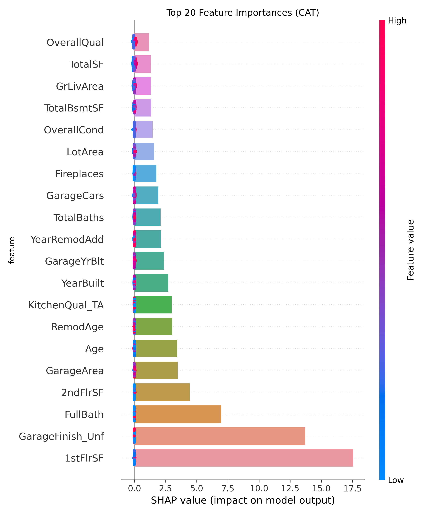

# house-prices-prediction

Dataset is taken from kaggle. https://www.kaggle.com/competitions/house-prices-advanced-regression-techniques/data

## Figure 1. SalePrice distribution (USD).

## Figure 2. Distribution of log(1+SalePrice).

 
## Figure 3. Top correlations with log(1+SalePrice).

## Figure 4. Validation RMSE (log target) across models.

## Figure 5. Predicted vs. actual SalePrice (USD) for CatBoost; dashed line is y = x.

## Figure 6. Top-20 features by CatBoost importance.

 
## Figure 7. SHAP summary for CatBoost

